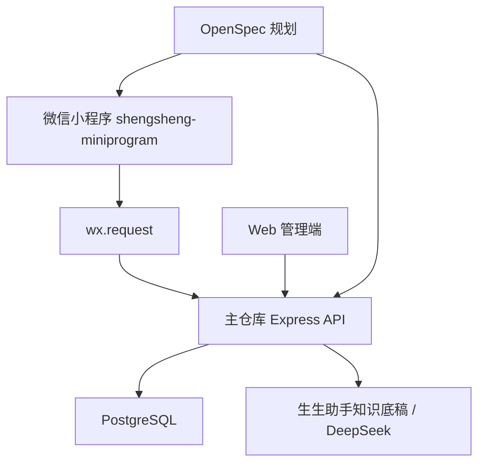

# 生生微信小程序项目详细说明

更新时间：2026-07-01

补充更新：2026-07-02 小程序活动动态与读书会服务层已改为后端 API 优先。`services/activities.ts` 调用 `/api/activities` 和 `/api/activities/:id`，`services/bookClub.ts` 调用 `/api/book-club/courses`、`/api/book-club/courses/:id` 和 `/api/book-club/sessions/:id/signup`；接口不可用时仍回退 `data/mock.ts`，用于开发期预览。本文后续历史段落若仍提到“活动动态/读书会仍读取 mock”，以本补充和当前代码为准。

补充更新：2026-07-06 小程序体验版和正式版已在 `config/env.ts` 指向 `https://shengshengcorp.com`，活动动态、读书会、亲子跑团和生生助手均通过服务器 API 读取同一套 PostgreSQL 数据。`data/mock.ts` 和本地助手兜底仅允许 `develop` 环境使用；`trial` 和 `release` 中接口失败会展示错误提示，不再静默显示 mock 数据或本地回答。本文后续历史段落若仍提到“体验版/正式版为空”“生产回退 mock”“接口失败使用本地兜底”，以本补充和当前代码为准。

补充更新：2026-07-07 为避免微信开发者工具里展示本地 mock 造成“网页和小程序数据不一致”，`develop`、`trial`、`release` 默认全部请求 `https://shengshengcorp.com`。`useLocalApiInDevelop` 和 `enableMockFallbackInDevelop` 默认均为 `false`，只有明确手动打开时才允许使用本机 API 或 mock；`data/mock.ts` 已同步为网页线上接口口径，读书会报名人数以服务器 `signups` 为准，王老师讲论语当前为 0。

补充更新：2026-07-08 小程序端安全边界已进一步收紧：`config/env.ts` 不再保留本机 API 地址、开发环境切换开关或 mock 兜底开关，`develop`、`trial`、`release` 均只知道线上 API 域名 `https://shengshengcorp.com`。小程序不得保存 `DATABASE_URL`、PostgreSQL 用户名密码、微信 AppSecret、DeepSeek API Key、管理员账号密码、服务器私钥或上传密钥；数据库连接、身份与权限校验、参数校验、名额校验、多智能体编排和 PostgreSQL `agent_*` 落库均由服务器后端负责。本文后续历史段落若仍提到“手动开启本机 API”“开发兜底 mock”或“本地助手兜底”，以本补充和当前代码为准。

本文档说明 `mulinguo97-oss/shengsheng-miniprogram` 仓库的项目定位、技术栈、目录结构、页面能力、服务层设计、后端接口依赖、微信开发者工具配置、运行方式、当前完成度、已知风险和后续路线。它用于后续开发、调试、交接和多智能体协同分析。

## 1. 项目定位

本项目是“生生文化”微信小程序一期工程。它面向微信用户，提供比网页更轻量、更便捷的移动入口。

一期目标不是一次性做完整会员系统和支付系统，而是先完成以下核心体验：

1. 用户打开小程序后能看到生生文化首页。
2. 用户能浏览生生读书会项目信息。
3. 用户能浏览生生亲子跑团活动。
4. 用户能在不做完整微信登录的情况下提交跑团轻量报名。
5. 用户能打开个人中心，查看服务器同步的资料、通知和报名记录。
6. 用户能向生生助手提问。
7. 小程序不直接保存任何后端密钥、数据库地址、模型 API Key 或 AppSecret。

当前 GitHub 仓库：

```text
https://github.com/mulinguo97-oss/shengsheng-miniprogram
```

本地固定目录：

```text
C:\Users\guomu\Desktop\生生\生生小程序搭建\微信小程序\shengsheng-miniprogram
```

主仓库，也就是网页前后端和 API 服务仓库：

```text
https://github.com/mulinguo97-oss/shengsheng
```

## 2. 小程序与主仓库的关系

小程序仓库只维护微信小程序端代码。后端接口、数据库、Web 管理端和 OpenSpec 规划在主仓库维护。



当前小程序开发、体验、正式环境默认请求：

```text
https://shengshengcorp.com
```

这意味着默认预览会直接读取网页同源服务器数据。小程序端不再提供本机 API 切换开关；如需本地联调，应使用独立开发分支或临时补丁，并在提交前恢复为只请求线上 API 域名。

## 3. 技术栈

| 技术 | 用途 |
| --- | --- |
| 原生微信小程序 | 运行在微信生态内的前端框架 |
| TypeScript | 页面逻辑、服务层和类型约束 |
| TDesign Miniprogram | UI 组件库 |
| miniprogram-api-typings | 微信小程序 API 类型定义 |
| miniprogram-ci | 后续上传、预览、CI 能力预留，当前尚未配置 npm script |
| pnpm | 包管理 |

当前依赖配置位于 `package.json`：

```json
{
  "dependencies": {
    "tdesign-miniprogram": "^1.15.2"
  },
  "devDependencies": {
    "miniprogram-api-typings": "^5.2.1",
    "miniprogram-ci": "^2.1.31",
    "typescript": "^5.9.3"
  }
}
```

## 4. 目录结构

```text
.
├── app.json
├── app.ts
├── app.wxss
├── config/
│   └── env.ts
├── data/
│   └── mock.ts
├── docs/
│   └── 微信小程序项目详细说明.md
├── pages/
│   ├── home/
│   ├── book-club/
│   ├── book-club-detail/
│   ├── parent-run/
│   ├── parent-run-detail/
│   ├── activity-detail/
│   ├── about/
│   └── assistant/
├── services/
│   ├── request.ts
│   ├── activities.ts
│   ├── bookClub.ts
│   ├── parentRun.ts
│   └── agents.ts
├── types/
│   ├── app.d.ts
│   └── domain.ts
├── package.json
├── pnpm-lock.yaml
├── pnpm-workspace.yaml
├── project.config.json
├── sitemap.json
└── tsconfig.json
```

### 4.1 根目录配置文件

| 文件 | 说明 |
| --- | --- |
| `app.json` | 小程序页面、窗口、TabBar、sitemap 配置入口 |
| `app.ts` | 小程序生命周期入口 |
| `app.wxss` | 全局样式 |
| `project.config.json` | 微信开发者工具项目配置 |
| `project.private.config.json` | 本机私有配置，已被 `.gitignore` 忽略 |
| `sitemap.json` | 小程序页面索引配置 |
| `tsconfig.json` | TypeScript 配置 |
| `package.json` | npm 依赖和脚本 |
| `pnpm-lock.yaml` | 依赖锁文件，应提交 |

### 4.2 不应提交的目录和文件

`.gitignore` 已忽略：

```text
node_modules/
miniprogram_npm/
project.private.config.json
*.log
.env
.env.*
private.*
*.key
*.pem
```

原因：

- `node_modules/` 是本地依赖目录；
- `miniprogram_npm/` 是微信开发者工具执行“构建 npm”后生成的构建产物；
- `project.private.config.json` 是开发者工具本机私有配置；
- `.env`、密钥、证书和日志不应进入公开仓库。

## 5. 页面结构

页面清单在 `app.json` 中声明：

```json
{
  "pages": [
    "pages/home/index",
    "pages/book-club/index",
    "pages/book-club-detail/index",
    "pages/parent-run/index",
    "pages/parent-run-detail/index",
    "pages/activity-detail/index",
    "pages/about/index",
    "pages/assistant/index"
  ]
}
```

TabBar 有四个主入口：

| Tab | 页面路径 | 说明 |
| --- | --- | --- |
| 首页 | `pages/home/index` | 品牌首页、功能入口、近期活动 |
| 读书会 | `pages/book-club/index` | 生生读书会项目列表 |
| 跑团 | `pages/parent-run/index` | 生生亲子跑团活动列表 |
| 个人中心 | `pages/about/index` | 登录、资料维护、通知和服务器报名记录 |

详情和工具页：

| 页面 | 页面路径 | 说明 |
| --- | --- | --- |
| 活动详情 | `pages/activity-detail/index` | 展示活动动态详情 |
| 读书会详情 | `pages/book-club-detail/index` | 展示课程详情和报名意向表单 |
| 跑团详情 | `pages/parent-run-detail/index` | 展示跑团详情和真实轻量报名表单 |
| 生生助手 | `pages/assistant/index` | 问答助手 |

## 6. 页面能力详解

### 6.1 首页 `pages/home`

首页是小程序第一屏，承担品牌入口和导航入口职责。

当前能力：

- 展示生生文化主视觉；
- 展示读书会入口；
- 展示亲子跑团入口；
- 展示生生助手入口；
- 展示近期活动列表；
- 点击活动可进入活动详情。

数据来源：

```text
services/activities.ts -> data/mock.ts
```

当前状态：

- 仍使用本地 mock 数据；
- 等主仓库新增活动动态后端接口后，应把 `services/activities.ts` 改为请求后端；
- 页面层无需大改，主要改 service 即可。

### 6.2 读书会列表 `pages/book-club`

读书会列表展示生生读书项目。

当前能力：

- 展示课程名称；
- 展示主讲人；
- 展示课程简介；
- 展示近期场次信息；
- 点击进入课程详情。

数据来源：

```text
services/bookClub.ts -> data/mock.ts
```

当前状态：

- 仍使用本地 mock；
- 读书会后端课程表、场次表、报名表尚未落地；
- 后续接入后端时，优先改 `services/bookClub.ts`。

### 6.3 读书会详情 `pages/book-club-detail`

读书会详情展示某个读书项目的详细信息，并提供轻量报名意向表单。

当前表单字段：

- 姓名；
- 手机号；
- 报名人数；
- 备注。

当前状态：

- 表单只做本地校验和 toast 提示；
- 尚未提交到后端；
- 原因是主仓库尚未提供读书会报名接口。

后续建议：

1. 主仓库新增读书会课程、场次、报名和取消记录表；
2. 主仓库新增 `POST /api/book-club/sessions/:id/signup`；
3. 小程序新增 `submitBookClubSignup` service；
4. 把 `pages/book-club-detail/index.ts` 的 `submitSignup` 改为真实请求。

### 6.4 跑团列表 `pages/parent-run`

跑团列表展示亲子跑团活动。

当前能力：

- 请求后端跑团活动列表；
- 失败时回退本地 mock；
- 展示日期、时间、地点、距离、名额、报名人数；
- 点击进入跑团详情。

真实接口：

```text
GET /api/parent-run/events
```

对应 service：

```text
services/parentRun.ts
```

### 6.5 跑团详情 `pages/parent-run-detail`

跑团详情是当前小程序里后端接入最完整的业务页面。

当前能力：

- 读取活动详情；
- 展示路线、说明、名额进度；
- 收集家长姓名、手机号、孩子年龄、报名人数、备注；
- 提交真实后端轻量报名接口；
- 提交成功后刷新当前活动报名人数；
- 提交中按钮 loading，避免重复点击；
- 后端错误提示会直接展示给用户。

真实接口：

```text
POST /api/parent-run/events/:id/guest-signup
```

请求体：

```json
{
  "parentName": "家长姓名",
  "phone": "13900000000",
  "childAge": "7 岁",
  "participantCount": 2,
  "note": "健康提醒或同行说明"
}
```

后端规则：

- 手机号必须是 11 位中国大陆手机号；
- 报名人数为 1 到 20；
- 同一活动同一手机号重复提交会更新原记录；
- 报名人数会计入跑团总报名人数；
- 当剩余名额不足时后端返回错误。

### 6.6 活动详情 `pages/activity-detail`

活动详情展示活动标题、摘要、时间、地点、分类等信息。

当前数据来源：

```text
services/activities.ts -> data/mock.ts
```

当前状态：

- 仍使用 mock；
- 没有正文富文本完整展示能力；
- 后续应配合活动动态后端模型扩展 `ActivityPost` 类型。

### 6.7 个人中心 `pages/about`

个人中心页面复用原 `pages/about` 路由，Tab 文案改为“个人中心”。

当前能力：

- 使用网页登录账号登录；
- 通过服务器 Cookie 会话读取 `/api/profile/me`；
- 展示用户基础资料、参与统计、通知和报名记录；
- 保存姓名、手机号、城市、兴趣和简介到服务器 `users` 表；
- 通知可标记已读；
- 保留进入生生助手的入口。

当前页面不再使用本地个人数据；未登录时只展示登录入口。

### 6.8 生生助手 `pages/assistant`

生生助手用于回答生生文化、读书会、亲子跑团和活动报名相关问题。

真实接口：

```text
POST /api/agents/chat
```

请求体：

```json
{
  "message": "用户问题",
  "history": [
    { "role": "user", "content": "上一轮用户问题" },
    { "role": "assistant", "content": "上一轮助手回答" }
  ],
  "channel": "miniprogram",
  "agent": "auto"
}
```

当前能力：

- 发起后端请求；
- 带最近 6 条历史上下文；
- 后端路由到品牌顾问、读书会顾问或跑团助手；
- 默认后端不可用时展示错误；仅在手动打开 `enableMockFallbackInDevelop` 后使用小程序本地兜底回答；
- 只回答生生文化、读书会、亲子跑团和活动报名相关问题。

## 7. 服务层设计

### 7.1 `services/request.ts`

这是小程序统一请求封装。

职责：

- 读取当前运行环境的 API baseUrl；
- 拼接完整请求 URL；
- 设置 JSON 请求头；
- 统一处理 2xx 成功响应；
- 读取后端 `message` 字段作为错误提示；
- 当没有配置 API 地址时直接 reject。

这层封装能避免页面里散落 `wx.request` 调用，是后续扩展登录 token、统一 loading、错误上报的基础。

### 7.2 `config/env.ts`

运行环境配置：

```ts
export const runtimeConfig = {
  develop: {
    apiBaseUrl: "https://shengshengcorp.com"
  },
  trial: {
    apiBaseUrl: "https://shengshengcorp.com"
  },
  release: {
    apiBaseUrl: "https://shengshengcorp.com"
  }
};
```

说明：

- `develop`、`trial`、`release` 均只请求线上 API 域名；
- 小程序端不保存数据库连接串、服务端密钥、管理员凭据或模型 Key；
- PostgreSQL 连接、权限校验、参数校验、名额校验和多智能体编排均由服务器后端完成；
- 上线前必须在微信公众平台配置 `https://shengshengcorp.com` 为合法 request 域名。

### 7.3 `services/activities.ts`

当前职责：

- 返回本地活动动态 mock；
- 根据 id 查找活动详情。

后续职责：

- 调用活动动态公开查询 API；
- 支持接口失败时是否回退 mock，需要根据产品要求决定。

### 7.4 `services/bookClub.ts`

当前职责：

- 返回本地读书会课程 mock；
- 根据 id 查找课程详情。

后续职责：

- 调用读书会课程列表 API；
- 调用读书会详情 API；
- 新增读书会报名提交 API。

### 7.5 `services/parentRun.ts`

当前职责：

- 调用 `GET /api/parent-run/events`；
- 接口失败时回退本地跑团 mock；
- 根据 id 查找跑团活动；
- 调用 `POST /api/parent-run/events/:id/guest-signup` 提交轻量报名。

这是当前最接近正式业务闭环的 service。

### 7.6 `services/agents.ts`

当前职责：

- 调用生生助手接口；
- 传递当前问题和最近历史；
- 接口失败时输出本地兜底回答。

注意：

- 小程序不直接调用 DeepSeek；
- 小程序不保存 DeepSeek API Key；
- 所有模型调用必须通过后端。

## 8. 类型模型

核心类型位于：

```text
types/domain.ts
```

### 8.1 `ActivityPost`

活动动态模型：

- `id`
- `title`
- `summary`
- `dateTime`
- `place`
- `category`
- `isPinned`

当前模型较轻，后续如果接活动正文、封面图、发布状态，需要扩展。

### 8.2 `BookClubCourse`

读书会课程模型：

- `id`
- `bookTitle`
- `lecturer`
- `lecturerBio`
- `summary`
- `nextSessionDate`
- `nextSessionTime`
- `place`
- `capacity`
- `participantCount`
- `notes`

当前小程序模型比网页端读书会完整模型更简化。后续接后端时，要统一课程、场次和报名结构。

### 8.3 `ParentRunEvent`

亲子跑团模型：

- `id`
- `date`
- `time`
- `title`
- `place`
- `distance`
- `capacity`
- `signupCount`
- `guestSignupCount`
- `notes`

其中 `signupCount` 是展示名额进度的关键字段，已经包含登录报名和游客轻量报名人数。

### 8.4 `ParentRunGuestSignupPayload`

跑团轻量报名请求体：

- `parentName`
- `phone`
- `childAge`
- `participantCount`
- `note`

### 8.5 `AssistantMessage`

助手消息模型：

- `role`: `user` 或 `assistant`
- `content`: 消息内容

## 9. Mock 数据

mock 数据位于：

```text
data/mock.ts
```

包含三类：

- `activityPosts`
- `bookClubCourses`
- `parentRunEvents`

mock 的作用：

1. 后端接口未完成前支撑页面开发；
2. 本地 API 不可用时提供兜底展示；
3. 帮助小程序在微信开发者工具中先跑通页面结构。

注意：

- mock 不应长期作为真实业务数据；
- 活动动态和读书会后续必须迁移到主仓库后端；
- 跑团 mock 只作为接口失败兜底，正常情况下应读取后端。

## 10. 微信开发者工具配置

### 10.1 导入项目

在微信开发者工具中导入目录：

```text
C:\Users\guomu\Desktop\生生\生生小程序搭建\微信小程序\shengsheng-miniprogram
```

### 10.2 构建 npm

因为项目使用 `tdesign-miniprogram`，导入后必须执行：

```text
工具 -> 构建 npm
```

构建成功后会生成：

```text
miniprogram_npm/
```

例如：

```text
miniprogram_npm/tdesign-miniprogram/button/button.json
```

如果没有构建 npm，页面 JSON 中引用的 TDesign 组件会找不到，常见表现是“模拟启动器失败”或组件解析错误。

### 10.3 本地接口调试

本地开发请求的是：

```text
http://127.0.0.1:3001
```

微信开发者工具默认会校验 request 域名和 HTTPS 证书，因此本地调试必须勾选：

```text
详情 -> 本地设置 -> 不校验合法域名、web-view（业务域名）、TLS 版本以及 HTTPS 证书
```

这个设置只用于开发阶段。体验版和正式版不能依赖这个设置。

### 10.4 体验版和正式版

上线前必须完成：

1. 主仓库后端部署到 HTTPS 域名；
2. 微信公众平台配置 request 合法域名；
3. `config/env.ts` 填入 `trial` 和 `release` 的 API 地址；
4. 使用真实 AppID；
5. 配置上传私钥或使用开发者工具上传；
6. 真机调试通过。

当前 `project.config.json` 中记录的 AppID 为：

```text
wx996653a40e12c016
```

项目名为：

```text
shengsheng-miniprogram
```

如果后续更换主体或测试号，需要同步检查微信公众平台、开发者工具和上传配置。

## 11. 本地开发步骤

### 11.1 安装依赖

```powershell
pnpm install
```

### 11.2 类型检查

```powershell
pnpm run typecheck
```

### 11.3 启动后端

进入主仓库：

```powershell
cd "C:\Users\guomu\Desktop\生生\生生小程序搭建\Pixel-perfect frontend recreation"
docker compose up -d db
pnpm dev:api
```

检查 API：

```powershell
curl http://127.0.0.1:3001/api/health
```

预期返回：

```json
{ "ok": true }
```

### 11.4 在微信开发者工具编译

1. 打开微信开发者工具；
2. 导入小程序项目目录；
3. 执行“工具 -> 构建 npm”；
4. 在“详情 -> 本地设置”勾选“不校验合法域名...”；
5. 点击“编译”；
6. 进入“跑团”页面验证后端接口；
7. 进入“生生助手”验证问答接口。

## 12. 当前已接入接口

### 12.1 跑团活动列表

```text
GET /api/parent-run/events
```

用途：

- 跑团列表页；
- 跑团详情页加载；
- 报名后刷新报名人数。

失败策略：

- service 会回退本地 mock；
- 控制台输出 warning。

### 12.2 跑团轻量报名

```text
POST /api/parent-run/events/:id/guest-signup
```

用途：

- 跑团详情页未登录轻量报名。

页面字段：

- 家长姓名；
- 手机号；
- 孩子年龄；
- 报名人数；
- 备注。

成功后：

- 后端返回更新后的 event；
- 页面刷新名额进度；
- 显示“跑团报名已提交”。

失败后：

- 展示后端返回的中文错误，例如“当前活动剩余名额不足。”

### 12.3 生生助手

```text
POST /api/agents/chat
```

用途：

- 生生助手页面问答；
- 活动详情和个人中心页面可跳转到助手继续咨询。

失败策略：

- 使用本地兜底回答。

### 12.4 个人中心

```text
GET /api/profile/me
PUT /api/profile/me
PUT /api/profile/messages/:id/read
```

用途：

- 个人中心登录后读取服务器用户资料；
- 从 PostgreSQL 聚合读书会报名、跑团报名和通知；
- 保存个人资料；
- 标记通知已读。

失败策略：

- 未登录时展示登录入口；
- 接口失败时展示错误提示，不回退本地假数据。

## 13. 当前未接入接口

### 13.1 活动动态

当前小程序首页和活动详情仍读取 mock。后续需要主仓库提供：

```text
GET /api/activities
GET /api/activities/:id
```

或其他最终确定的活动动态接口。

### 13.2 读书会

当前小程序读书会列表和详情仍读取 mock。后续需要主仓库提供：

```text
GET /api/book-club/courses
GET /api/book-club/courses/:id
POST /api/book-club/sessions/:id/signup
```

接口命名以主仓库 OpenSpec 和最终实现为准。

### 13.3 多智能体统一入口

当前小程序已接入：

```text
POST /api/agents/chat
```

旧接口仍由主仓库后端兼容：

```text
POST /api/shengsheng-skill/chat
```

新请求会带 `channel: "miniprogram"` 和 `agent: "auto"`，由主仓库后端统一完成安全审核、意图路由、DeepSeek 调用或本地知识底稿降级，并写入服务器 PostgreSQL 的 `agent_*` 表。

## 14. 当前完成度

### 已完成

- 独立 GitHub 仓库；
- 原生微信小程序工程；
- TypeScript 配置；
- TDesign Miniprogram 接入；
- 首页、读书会、跑团、个人中心四个 Tab；
- 活动详情页；
- 读书会详情页和报名意向表单；
- 跑团详情页和真实轻量报名；
- 生生助手页面；
- API 请求封装和服务器 Cookie 会话保存；
- 开发、体验、正式环境默认服务器 API 地址；
- `pnpm run typecheck` 校验通过；
- npm 构建产物已能在本地生成。

### 部分完成

- 生生助手已切到后端多智能体统一接口；
- 个人中心已接后端聚合接口，仍需在微信开发者工具和真机完成登录态验证。

### 未完成

- 微信登录；
- 用户报名记录查看；
- 取消报名；
- 活动动态真实接口；
- 读书会真实接口；
- 读书会报名真实提交；
- 体验版和正式版 API 地址；
- HTTPS 合法域名；
- miniprogram-ci 自动上传配置；
- miniprogram-ci 相关 npm script；
- 真机调试验收；
- 小程序端自动化测试。

## 15. 已知风险

### 15.1 开发版接口地址不能用于上线

`http://127.0.0.1:3001` 只适合开发者工具本机调试。体验版和正式版必须使用 HTTPS 域名。

### 15.2 `trial` 和 `release` 当前为空

如果直接上传体验版或正式版，小程序在这些环境中会因为没有 `apiBaseUrl` 而无法请求后端。

### 15.3 TDesign 必须构建 npm

每次依赖变化后都应执行“工具 -> 构建 npm”。如果缺少 `miniprogram_npm`，模拟器可能启动失败。

### 15.4 mock 兜底可能掩盖接口故障

跑团列表接口失败时会显示 mock 数据。开发阶段方便，但验收时需要观察网络请求或后端日志，确认真实接口已经请求成功。

### 15.5 读书会和活动尚未统一数据源

这两块仍然是本地 mock，不能代表正式内容管理能力。

### 15.6 小程序不能保存敏感配置

严禁在小程序代码中放入：

- AppSecret；
- 数据库地址；
- 管理员账号密码；
- DeepSeek API Key；
- 上传私钥；
- 服务端私钥。

### 15.7 名额进度条需要防御异常容量

跑团详情页进度条当前按 `signupCount * 100 / capacity` 计算。后端已有名额大于 0 的校验，但如果未来接入其他数据源或手工导入异常数据，`capacity = 0` 会造成显示异常。后续可在页面层增加兜底，例如把分母限制为至少 1。

## 16. 后续开发路线

建议按以下顺序推进：

1. 主仓库完成活动动态后端表和公开接口；
2. 小程序 `services/activities.ts` 改为请求活动接口；
3. 主仓库完成读书会课程、场次、报名和取消记录接口；
4. 小程序 `services/bookClub.ts` 改为请求读书会接口；
5. 小程序读书会详情页提交真实报名；
6. 增加微信登录或手机号授权策略；
7. 实现用户报名记录和取消报名；
8. 后端部署 HTTPS 域名；
9. 配置 `trial` 和 `release` API 地址；
10. 使用微信开发者工具进行真机调试；
11. 使用 miniprogram-ci 做预览、上传和自动化流程；
12. 接入多智能体统一接口。

## 17. 多智能体协同建议

后续继续开发时，可以拆成以下智能体角色：

| 智能体 | 职责 |
| --- | --- |
| 产品规划智能体 | 梳理用户场景、页面流程、优先级 |
| 后端接口智能体 | 设计 PostgreSQL 表、Express API、错误码和接口契约 |
| 小程序页面智能体 | 实现页面、表单、TDesign 组件和交互状态 |
| 联调验收智能体 | 验证微信开发者工具、网络请求、真机调试和边界场景 |
| 文档维护智能体 | 同步 README、详细说明、OpenSpec 和任务列表 |

协同原则：

1. 后端接口契约先稳定，小程序再接入；
2. 页面 service 层优先改造，减少页面层重复请求逻辑；
3. 所有跨端数据以主仓库后端为准；
4. 小程序端只保留展示逻辑和轻量状态；
5. 涉及登录、支付、敏感配置时必须先明确安全方案。

## 18. 常见问题

### 18.1 为什么导入后模拟器失败？

优先检查是否已执行：

```text
工具 -> 构建 npm
```

如果 `miniprogram_npm/tdesign-miniprogram/button/button.json` 不存在，TDesign 组件会解析失败。

### 18.2 为什么请求不了本地后端？

检查三件事：

1. 主仓库 API 是否已启动；
2. `http://127.0.0.1:3001/api/health` 是否返回 `{ "ok": true }`；
3. 微信开发者工具是否勾选“不校验合法域名、web-view（业务域名）、TLS 版本以及 HTTPS 证书”。

### 18.3 为什么体验版请求失败？

因为 `config/env.ts` 中 `trial.apiBaseUrl` 目前为空。体验版必须配置 HTTPS 后端域名。

### 18.4 为什么活动和读书会数据看起来是假数据？

因为这两块后端统一数据源尚未完成，小程序仍读取 `data/mock.ts`。

### 18.5 小程序仓库是否包含后端？

不包含。小程序仓库只包含微信小程序端。后端在：

```text
mulinguo97-oss/shengsheng
```

## 19. 提交流程

本仓库是独立 Git 仓库，远端为：

```text
https://github.com/mulinguo97-oss/shengsheng-miniprogram.git
```

常用命令：

```powershell
git status
git add .
git commit -m "type(scope): 中文说明"
git push origin main
```

提交前建议执行：

```powershell
pnpm run typecheck
```

如修改依赖，还应在微信开发者工具中重新执行“构建 npm”，但不要提交生成的 `miniprogram_npm/`。
